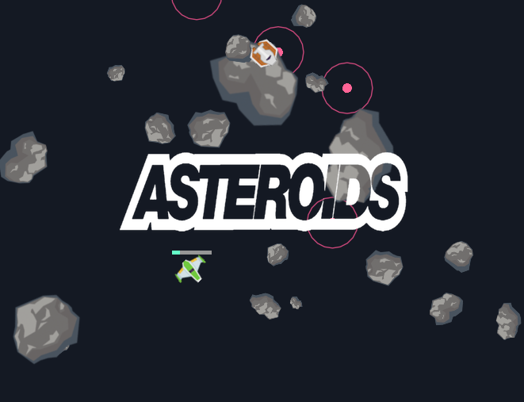
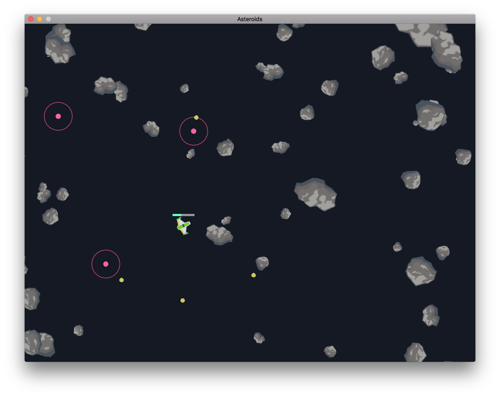

# Asteroids

Remake of the Asteroid classic retro game with Lua and [Love2D](https://love2d.org). This is a prototype.



## Download

You can download the game at [florimondmanca.itch.io](https://florimondmanca.itch.io/asteroids).

## Installation

These are more advanced instructions for installing and building the game yourself.

1. Make sure you have installed [Love2D](https://love2d.org) version 11.3+.

2. Clone the repo.

## Run the game

Use `make` to build and run the game.

```bash
$ make
```



## References

Assets: [Kenney Space Shooter Redux](http://kenney.nl/assets/space-shooter-redux).

Third-party Lua packages: [lume](https://github.com/rxi/lume), [hump](http://hump.readthedocs.io/en/latest/gamestate.html)
